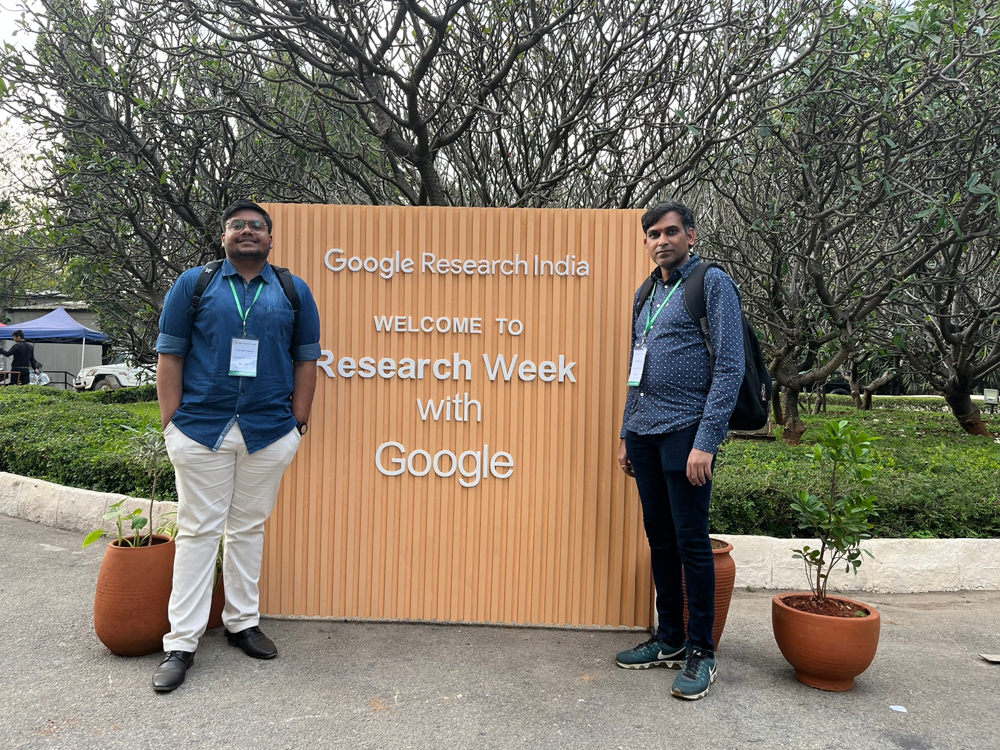
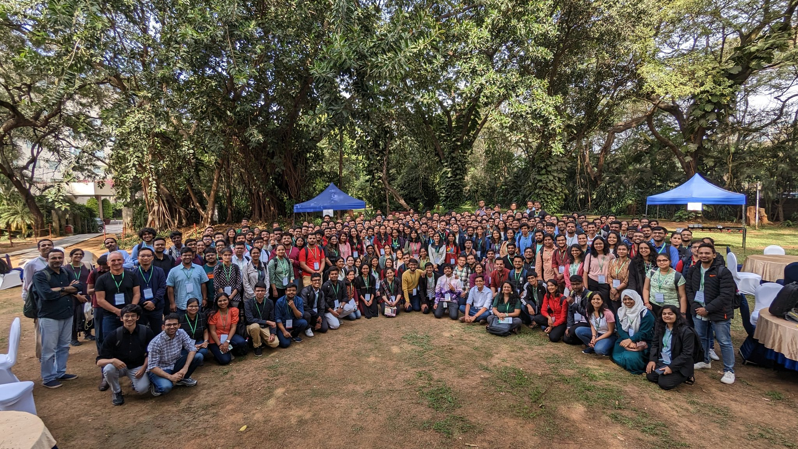

---
aliases:
- /Research Week/AI Research/2023/02/13/Research-Week-With-Google
categories:
- Research Week
- AI Research
comments: false
date: '2023-02-13'
description: Research Week Experience
hide: false
layout: post
search_exclude: false
title: Research Week With Google 2023
toc: true

---

Google Research India conducts reseach week, where students are exposed to latest research happenings in Computer Vision, NLP, Machine Learning and alied areas. Applications are invited during year end, typically during November/December months. I was selected and hence had the opportunity to attend "[Research Week With Google 2023](https://sites.google.com/view/researchweek2023/)", in **<u>Computer Vision B</u>** track from 29-31 January, 2023.

Below is the summary of the talks and my experiences specifically related to **<u>Computer Vision B</u>** track.

### **Day1**

**<u>KeyNote</u>** : The day was started with a key-note by [Prateek](https://www.prateekjain.org/) and [Partha](https://parthatalukdar.github.io/). An overview of the program along with different reseach areas in ML related to OOD, specifically simplicity Bias was provided by [Prateek](https://www.prateekjain.org/). [Partha](https://parthatalukdar.github.io/) covered different aspects of NLP and challenges related to Multilingual and Multimodal aspects. Fairness implications related to NLP were also discussed. Finally, interesting research directions were laid out to the audience.

**<u>Robustifying Deep Neural Networks Talk</u>** : This talks was given by [Prof. R. Venkatesth Babu](http://cds.iisc.ac.in/faculty/venky/) in which he discussed about efficient algorithms for adversarial training. Other topics such as Single Step adversarial training with drop-out scheduling, Towards achieving adversarial robustness by enforcing feature consistency across bit planes were also discussed. The session was highly stimulating and insightful.

**<u>Continual Query Releases Talk</u>** : This session was giveny by [Prof. Himanshu Tyagi](https://ece.iisc.ac.in/~htyagi/). Insighful details were provided about privacy techniques, epsilon differential privacy their definitions, applications specifically in the context of Continual Query Releases. This talk underscored the importance and the need for differential privacy particulary within the context of current deep learning algorithms.

**<u>Machine Learning UsesCases</u>** : In this last part of the session [Gaurav Aggarwal](https://research.google/people/GauravAggarwal/) presented different use cases that are very relevant to Indian context. Some of them which inspired me are using machine learning for satellite images and analysing hand written prescriptions.

The socials were enjoyable and helped connect with different speakers.

Me and Harsh on Day1

### **Day2**

**<u>KeyNote</u>** : In this keynote on Day2, [Doina Precup](https://mila.quebec/en/person/doina-precup/) covered various aspects of Reinforcement Learning with a focus on Synthesizing new behaviour with combinations of reward functions, continual reinforcement learning and agent interactions with humans among others. This talks is high informative and helped delve into the world of reinforcement learning and its applications.

**<u>Memory Safety and the case of modular VM development</u>** : This talk given by [Steve Blackburn](https://mila.quebec/en/person/doina-precup/) is one of my favourite. This covered various aspects of low level details that are of importance to garbage collection and virtual machines. This talks really inspired to look at low level system details that can have huge impact at web scale.

**<u>Vision Models, OOD and Others</u>** : In this talk by [Pradeep Shenoy](https://research.google/people/106965/), various techniques and recent work that address OOD, Multi-object Multi-Part Segmentation i.e. compositionality, learning under slow concept drift, selective classification & domain adapation and adaptive mixing of losses were presented.

Me with Steve Blackburn on Day2 during Socials

### **Day3**

**<u>KeyNote</u>** : In the last day of the keynote [Jeff Dean](https://research.google/people/jeff/) presented the current trends of Deep Learning. Some of these include LLMs, Generative Models, Model Scaling, Single Model that can generalize across modalities/tasks, efficient sparse mdoels, computational photography using DL, Impact in Engineering, Science, Health and Sustainability, Deeper and broader understanding of ML and finally Principles for responsible AI. This gave a bird's eye view of different facets and directions that one can undertake research broadly. This talk is extremely interesting and thought provoking.

**<u>ML for Climate, Earth Observation, Weather etc.</u>** : In this talk by [Varun Gulshan](https://research.google/people/105170/), the usage of deep learning techniques for weather prediction, climate change were presented. This is an important application and provided interesting direction from an application perspective for weather and climate sciences.

**<u>Is Classification All you need for computer vision</u>** : In this final talk by [Prof. Angela Yao](https://www.comp.nus.edu.sg/~ayao/), professor covered various facets of losses, how, why and the intricacies of them in the context of classification. Although this talk is theoritical in nature, this has helped my understanding the intricacies of loss functions and their workings in deep learning.

With everyone on Final Day

Along with this, fireside chats and panel discussions helped the audience understand various career options and research as a career choice.

It was a wonderful experience attending "Research Week With Google 2023". This event helped  me understand the latest happenings, current directions and answer questions on various topics. This is a an opportunity that no one can miss. I highly enjoyed the event.

Feel free to go though the [Research Week with Google 2023](https://sites.google.com/view/researchweek2023/) website for more details.

**References** :

- [Research Week with Google 2023](https://sites.google.com/view/researchweek2023/)
- [Research Week with Google - officially a wrap! ](https://twitter.com/divy93t/status/1620435751220711425?s=20)
- [Research Week w/ Google](https://twitter.com/divy93t/status/1619232027613749250?s=20)
- [Research Week w/ Google Apply!!!](https://twitter.com/divy93t/status/1592599586681786368?s=20)
